# Pull Request Dokumentation

Stand: 22.05.2026

Repository URL:
https://github.com/FionnLaesser/M324_PROJEKT_TODOLIST

## Todo-Validierung

In diesem Pull Request wurde eine echte Änderung an der Todo-Liste umgesetzt.
Leere Todo-Beschreibungen sollen nicht gespeichert werden. Das gilt auch dann,
wenn das Eingabefeld nur Leerzeichen enthält.

Umgesetzte Änderung:

- Leere Todo-Beschreibungen werden im Backend verhindert.
- Eingaben mit nur Leerzeichen werden nicht gespeichert.
- Die Beschreibung wird vor dem Speichern mit `trim()` bereinigt.
- Ein Test prüft, dass leere Todo-Beschreibungen nicht gespeichert werden.

## Bewertungspunkte

### 1. Issue erstellt

Für die Änderung wurde ein Issue erstellt. Das Issue beschreibt, dass leere Todos
verhindert werden sollen und nennt die wichtigsten Akzeptanzkriterien.

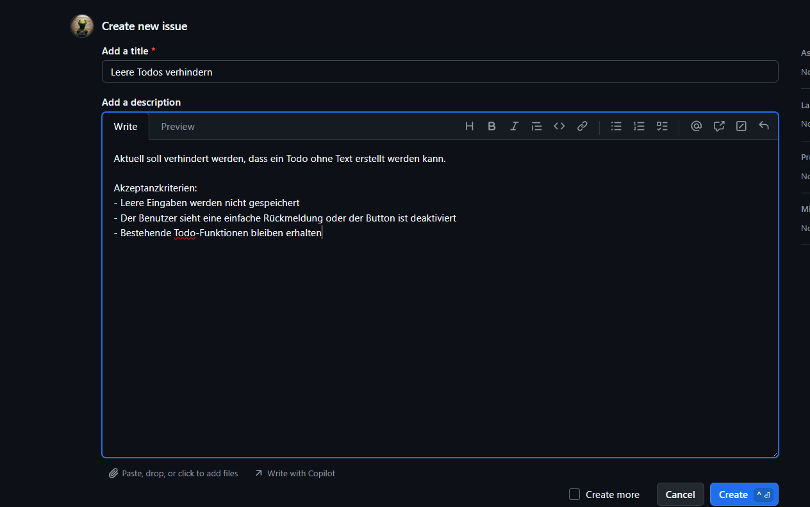

### 2. Feature-Branch erstellt

Für die Umsetzung wurde ein eigener Feature-Branch erstellt. Der Branch heisst
`feature/todo-validation` und trennt die Änderung vom `main`-Branch.

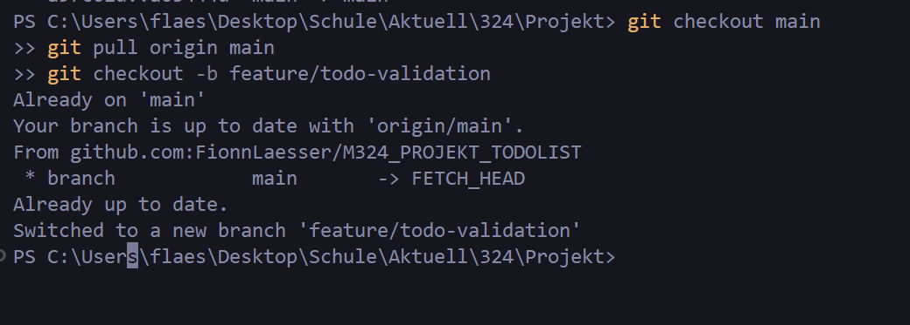

### 3. Änderungen implementiert

Die Codeänderung verhindert, dass leere Todo-Beschreibungen gespeichert werden.
Dabei wird geprüft, ob die Beschreibung `null`, leer oder nur aus Leerzeichen
besteht.

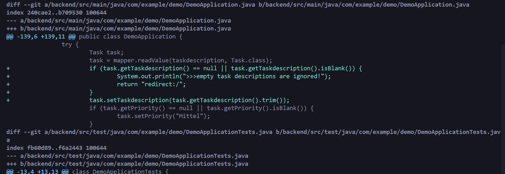

### 4. Commit mit closes #2

Der Commit enthält den Bezug zum Issue mit `closes #2`. Dadurch kann GitHub das
Issue nach dem Merge automatisch schliessen.

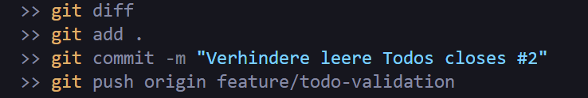

### 5. Pull Request erstellt

Der Pull Request wurde von `feature/todo-validation` nach `main` erstellt. Damit
wurden die Änderungen aus dem Feature-Branch zur Übernahme in den Hauptbranch
vorgeschlagen.

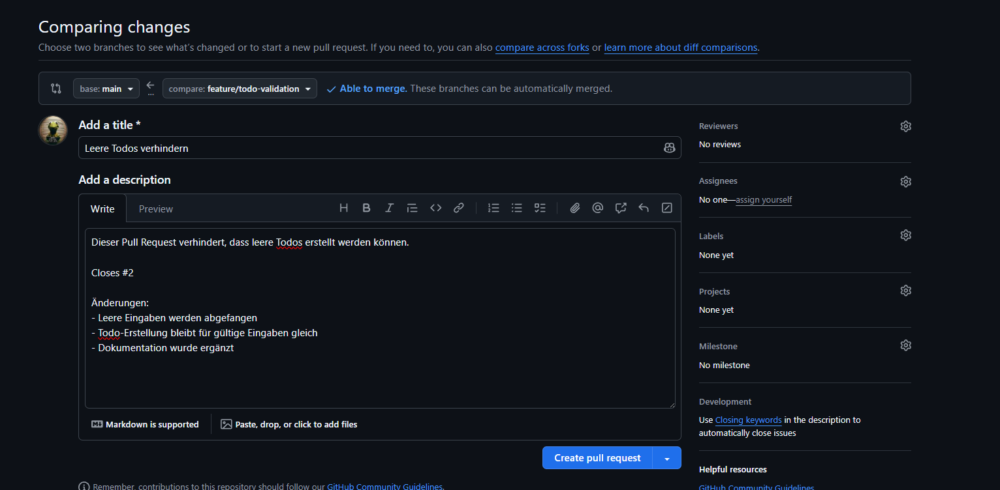

### 6. Sparring als Reviewer

Für das Review wurde ein Sparring-Partner als Reviewer eingetragen. Dadurch wurde
die Änderung nicht nur allein umgesetzt, sondern auch von einer zweiten Person
angeschaut.

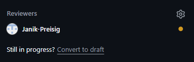

### 7. Review dokumentiert

Das Review wurde im Pull Request dokumentiert. Der Kommentar bestätigt, dass die
Änderung nachvollziehbar ist, das Issue erfüllt und keine Konflikte vorhanden
sind.

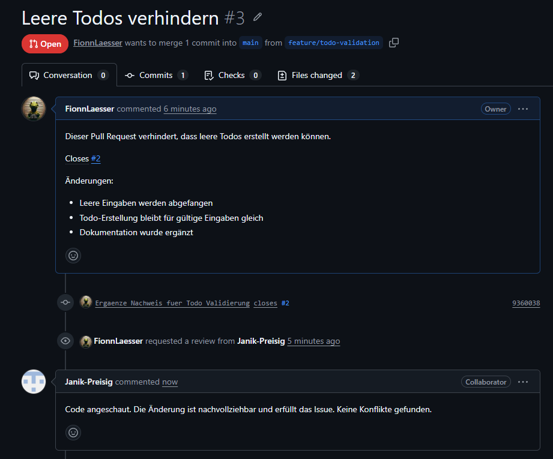

### 8. Pull Request genehmigt und durchgeführt

Der Pull Request wurde überprüft und war bereit zum Merge. GitHub zeigte keine
Konflikte mit dem Base-Branch an. Dadurch konnte der Pull Request durchgeführt
werden.

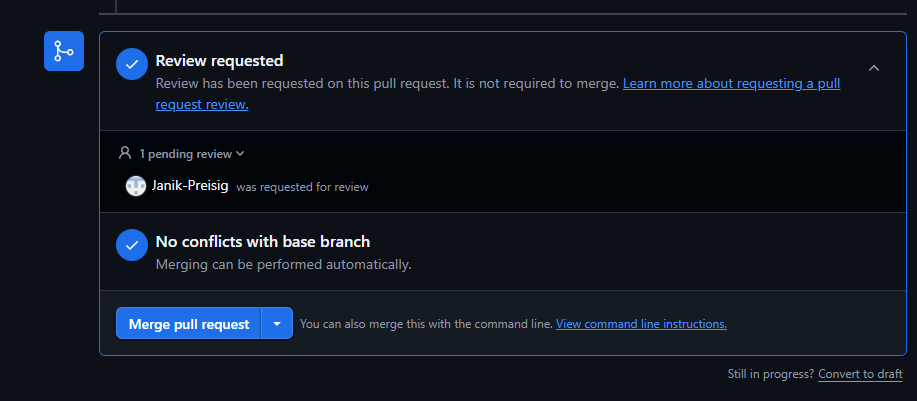

### 9. Pull Request online gemerged

Der Pull Request wurde online auf GitHub in den `main`-Branch gemerged. Damit
wurden die Änderungen aus dem Feature-Branch in den Hauptstand übernommen.

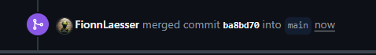

### 10. Issue automatisch geschlossen

Nach dem Merge wurde das Issue automatisch geschlossen, weil der Commit oder Pull
Request den Hinweis `closes #2` enthielt.

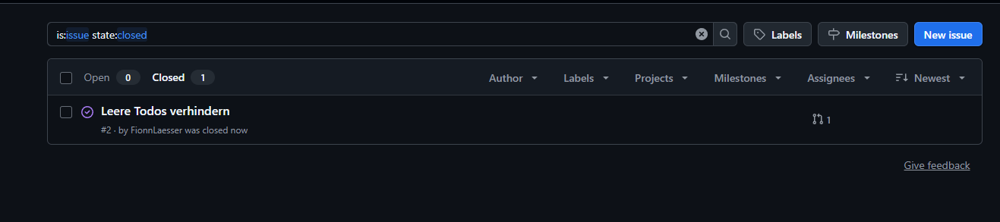

### 11. Lokales Repo aktualisiert

Nach dem Online-Merge wurde lokal wieder auf `main` gewechselt und der aktuelle
Stand von GitHub geholt. Danach wurde mit `git status` und
`git log --oneline -5 --decorate` geprüft, dass das lokale Repository
aktualisiert ist.

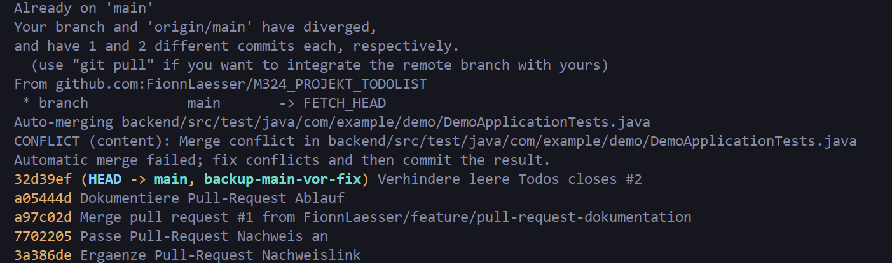

## Fazit

In diesem Projekt wurde ein Issue zur Todo-Validierung erstellt. Danach wurde ein
eigener Feature-Branch `feature/todo-validation` verwendet, eine echte
Codeänderung umgesetzt, ein Commit mit `closes #2` erstellt und ein Pull Request
nach `main` durchgeführt. Der Pull Request wurde durch den Sparring-Partner
überprüft, online gemerged und das Issue wurde automatisch geschlossen. Danach
wurde das lokale Repository aktualisiert.
