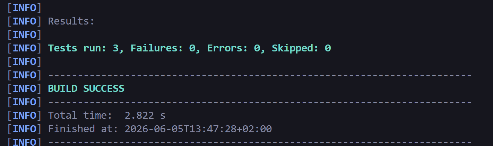
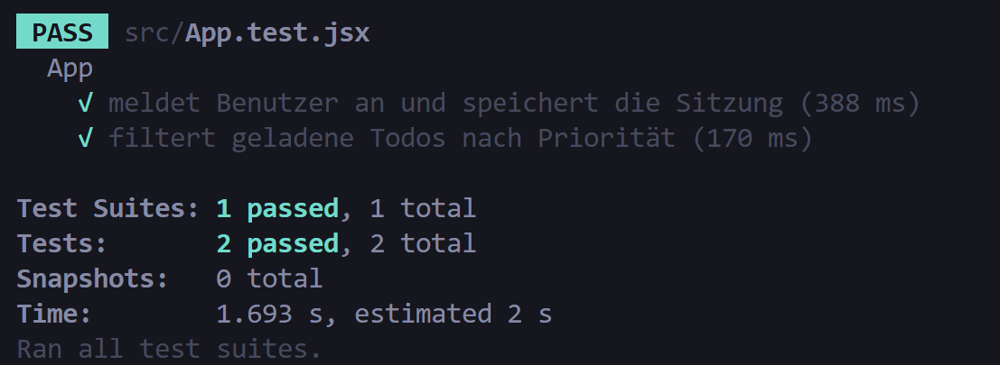
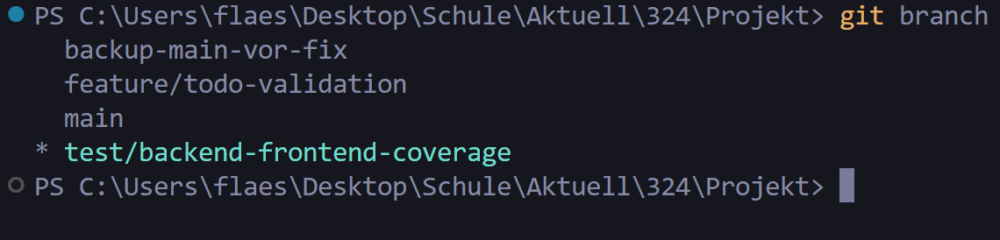
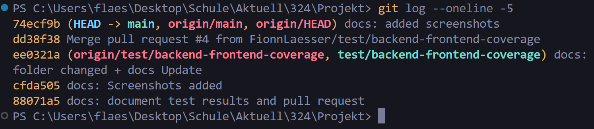
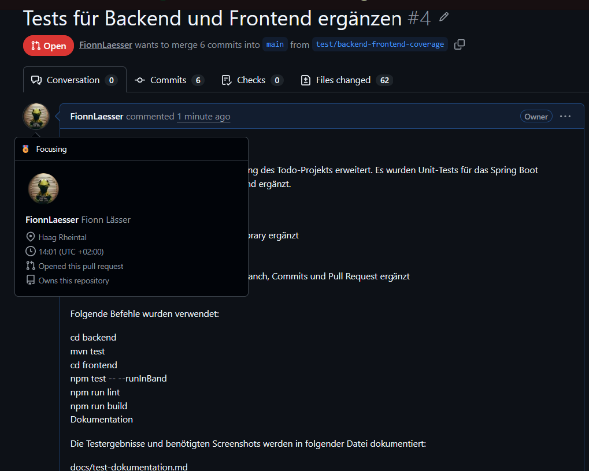
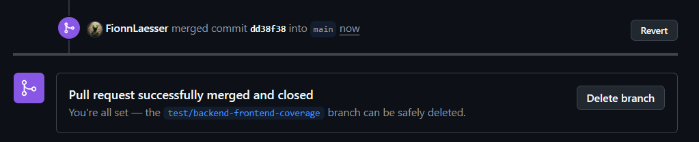

# Test-Dokumentation

## Github
Link: [Repository](https://github.com/FionnLaesser/M324_PROJEKT_TODOLIST)

## Backend-Tests

Datei: `backend/src/test/java/com/example/demo/service/TodoServiceTest.java`

Erstellte Tests:

- `createTodoTrimsDescriptionAndUsesDefaultPriority`: Prüft, dass Todo-Beschreibungen getrimmt werden, ein gültiges Fälligkeitsdatum übernommen wird und ohne Priorität automatisch `Mittel` gesetzt wird.
- `createTodoRejectsDuplicateDescription`: Prüft, dass ein bereits vorhandenes Todo in derselben Liste mit `409 CONFLICT` abgelehnt wird.
- `createTodoRejectsInvalidPriority`: Prüft, dass eine ungültige Priorität mit `400 BAD_REQUEST` abgelehnt wird.

Ausgeführter Befehl:

```powershell
cd backend
mvn test
```

Ergebnis: Erfolgreich, 3 Tests bestanden.

## Frontend-Tests

Datei: `frontend/src/App.test.jsx`

Erstellte Tests:

- `meldet Benutzer an und speichert die Sitzung`: Prüft Login-UI, API-Aufruf und Speicherung des Tokens im Local Storage.
- `filtert geladene Todos nach Priorität`: Prüft die Anzeige geladener Todos und den Prioritätsfilter mit Zurücksetzen-Funktion.

Ausgeführter Befehl:

```powershell
cd frontend
npm test -- --runInBand
```

Ergebnis: Erfolgreich, 2 Tests bestanden.

Zusätzliche Prüfungen:

```powershell
cd frontend
npm run lint
npm run build
```

Ergebnis: Erfolgreich.

## Screenshots












